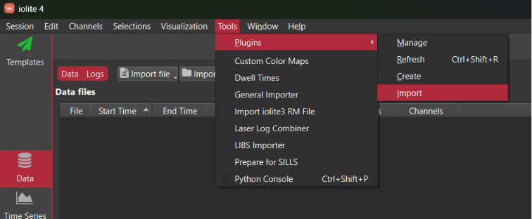
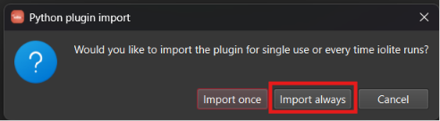
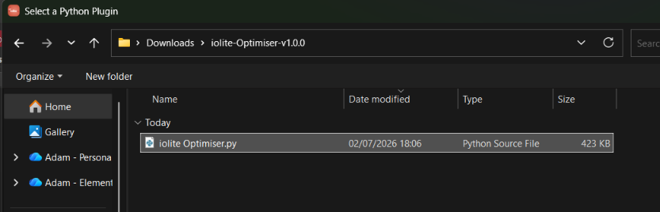
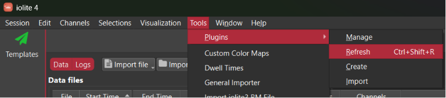
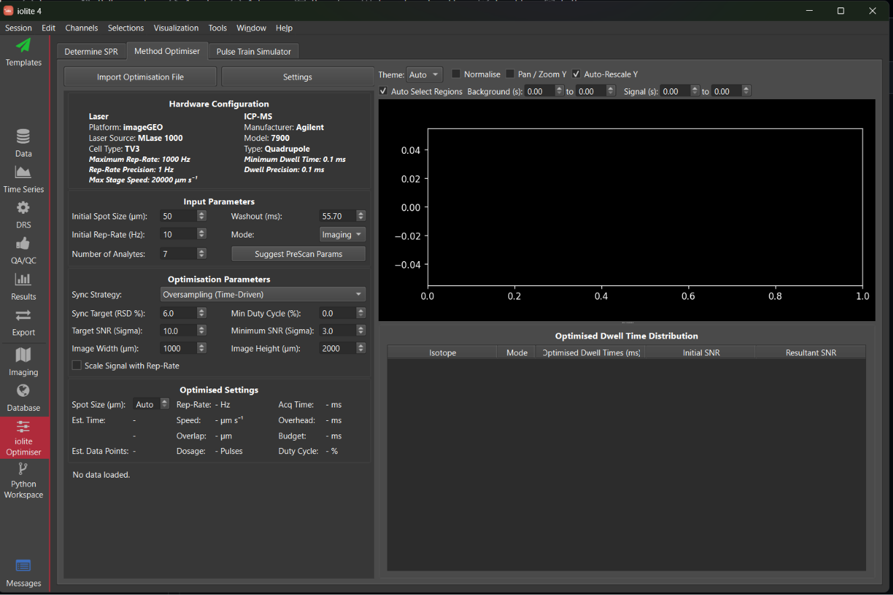
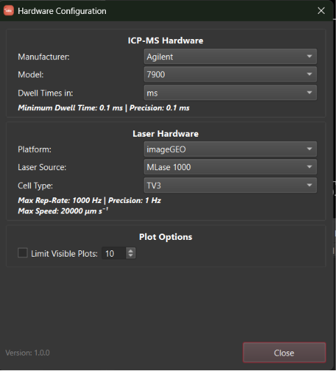

# iolite Optimiser (v1.0.0)

An advanced optimization and simulation plugin for **iolite 4** to determine the best combination of **Spot Size**, **Laser Repetition Rate**, and **Scan Speed** (or Dwell/Acquisition Times) for laser ablation ICP-MS analyses.

---

## Features

- **Single Pulse Response (SPR) Characterization**: Analyze washout curves and composite peak shapes.
- **PreScan Suggestions**: Calculate suggested conditions for pre optimisation scan.
- **Instrument Setup Optimization**: Sync laser firing frequencies with mass spectrometer integration cycles using multiple sync strategies.
- **Pulse Train Simulator**: Model sequential sweeps, washout scaling, and detector carryover.

---

## Installation Guide

Follow these steps to install the plugin in iolite 4:

### Step 1: Download and Extract

1. Download the release `.zip` package from GitHub.
2. Unzip the archive to a local folder (e.g., your `Downloads` directory).

### Step 2: Open Plugins Menu in iolite

1. Launch **iolite 4**.
2. Go to the menu bar at the top and select **Tools** -> **Plugins** -> **Import**.

### Step 3: Select Import Mode

1. When prompted with the import mode dialog, click **Import always** (this ensures the plugin loads automatically every time iolite is started).

### Step 4: Select the Plugin File

1. In the file browser that appears, navigate to your extracted folder (e.g. `iolite-Optimiser-v1.0.0`).
2. Select **`iolite Optimiser.py`** and click **Open**.

### Step 5: Refresh Plugins

1. Once imported, go to **Tools** -> **Plugins** -> **Refresh** (or use the shortcut `Ctrl+Shift+R`) to reload and register the new plugin within iolite.

### Step 6: Verify Access

1. The **iolite Optimiser** icon will now appear in your left sidebar in iolite. Click it to open the main window.

2. Open the **Settings** (Hardware Configuration) dialog to configure your instrumentation, the version number of the plugin is also show heren (`Version: 1.0.0`).

---

## User Documentation

For details on configuration and workflow steps, refer to the manuals in the `docs` folder:

- [Advanced Optimiser Tab Manual](docs/Optimiser_Manual.md)
- [Single Pulse Response (SPR) Tab Manual](docs/SPR_Manual.md)
- [Pulse Train Simulator Tab Manual](docs/Pulse_Train_Simulator_Manual.md)
- [Optimisation Workflow Manual](docs/Optimisation_Workflow_Manual.md)
